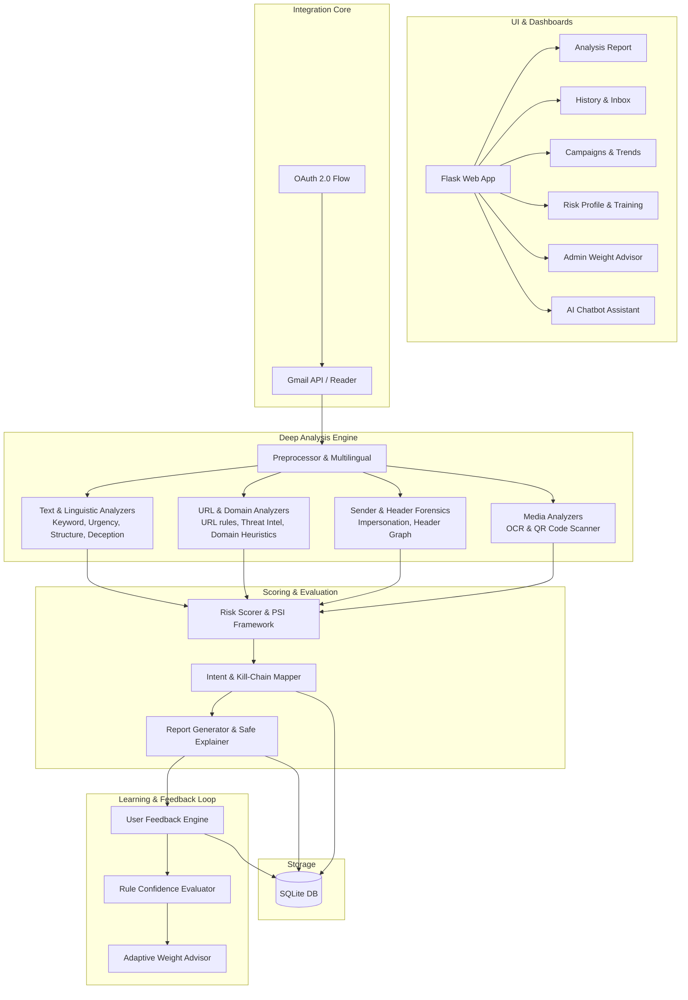

# 🛡️ PhishGuard — Explainable Phishing Email Risk Analyzer

> A novel, explainable phishing detection system that analyzes real Gmail emails via OAuth, assigns transparent risk scores with feature-wise contribution breakdowns, classifies phishing intent, and provides human-readable awareness alerts.

---

## 🎯 Project Novelty

Unlike black-box ML phishing detectors, PhishGuard provides **complete transparency**:

| Feature | PhishGuard | Traditional ML Detectors |
|---|---|---|
| Explainability | ✅ Every decision explained | ❌ Black-box predictions |
| Feature Contributions | ✅ Per-analyzer score breakdown | ❌ Hidden feature importance |
| Real Email Analysis | ✅ Live Gmail integration | ❌ Usually offline datasets |
| Intent Classification | ✅ 5 categories with reasoning | ❌ Binary safe/phishing |
| User Awareness | ✅ Contextual safety tips | ❌ No educational component |
| Privacy | ✅ Read-only, no body storage | ⚠️ Varies |

---

## 🏗️ Architecture



---

## 📋 Prerequisites

- Python 3.10+
- A Google Cloud project with Gmail API enabled

---

## 🔧 Setup Instructions

### 1. Google Cloud OAuth Credentials

1. Go to [Google Cloud Console](https://console.cloud.google.com/)
2. Create a new project (or select an existing one)
3. Navigate to **APIs & Services → Library**
4. Search for **Gmail API** and **Enable** it
5. Go to **APIs & Services → Credentials**
6. Click **Create Credentials → OAuth 2.0 Client ID**
7. Select **Web Application** as the application type
8. Add `http://localhost:5000/oauth/callback` to **Authorized redirect URIs**
9. Download the JSON file and save it as `credentials.json` in the project root
10. Go to **OAuth Consent Screen** and add your Google account as a **Test User**

### 2. Install Dependencies

```bash
cd phishing-analyzer
pip install -r requirements.txt
```

### 3. Run the Application

```bash
python app.py
```

Open your browser at **http://localhost:5000**

### 4. Run Tests (no Gmail needed)

```bash
python test_engine.py
```

---

## 🧩 Project Structure

```text
phishing-analyzer/
├── app.py                     # Flask web application & routes
├── config.py                  # Central configuration
├── database.py                # SQLite logging
├── phishing_engine.py         # Main engine (orchestrates analyzers)
├── risk_scorer.py             # Basic risk scoring & intent classification
├── preprocessor.py            # Email text preprocessing
├── gmail_*.py                 # Gmail OAuth & reading
├── static/, templates/        # Premium UI assets & HTML templates
├── requirements.txt           # Dependencies
│
├── Modules (Analyzers):
│   ├── multilingual.py        # Language detection and translation
│   ├── header_forensics.py    # Email header analysis
│   ├── ocr_analyzer.py        # Text extraction from images
│   ├── qr_analyzer.py         # QR code detection & threat check
│   ├── domain_heuristics.py   # Deep domain analysis
│   ├── linguistic_deception.py# AI-backed linguistic checks
│   └── threat_intel.py        # External threat feed integration
│
├── Modules (Enrichment & Explainability):
│   ├── killchain.py           # MITRE ATT&CK style mapping
│   ├── severity_index.py      # Phishing Severity Index (PSI)
│   ├── safe_explainer.py      # Explain why an email is safe
│   ├── header_graph.py        # Visual route graph for headers
│   └── sender_trust.py        # Domain trust history
│
├── Modules (User & Admin Tools):
│   ├── chatbot_service.py     # Context-aware AI assistant
│   ├── campaign_detector.py   # Cross-email campaign clustering
│   ├── forensic_export.py     # JSON/PDF export for forensics
│   ├── risk_profile.py        # User risk exposure
│   ├── training_sim.py        # Interactive scenarios and simulations
│   ├── weekly_summary.py      # Weekly security digests
│   └── feedback.py / weight_advisor.py # Adaptive machine learning weights
└── ascend/                    # Advanced counterfactual & psychological modules
```

---

## 🔍 How the Scoring Engine Works

### The Primary Analyzers

Each analyzer independently evaluates one aspect of the email and returns scored **Findings** — each with evidence and a human-readable explanation.
The system features an adaptive weighting system, but base scores are configured logically:

#### 1. 🔤 Keyword & Linguistic Analyzer (Max 25 pts)
Scans subject + body for phishing phrases and linguistic deception using NLP.
- Known phishing keywords (e.g., "account suspended") → 5 pts each
- Manipulative linguistics and artificial urgency → up to 15 pts

#### 2. 🔗 URL & Domain Analyzer (Max 25 pts)
Detects red-flag URLs and anomalous domains:
- **Shortened links**, **IP-based URLs**, or **Excessive subdomains** (5-10 pts)
- **Anchor text mismatch** (display text ≠ href) → 10 pts
- Enhanced by **Threat Intelligence** and **Domain Heuristics**.

#### 3. 👤 Sender, Trust & Header Forensics (Max 20 pts)
Inspects the identity and transit history:
- **Brand impersonation** or **Free email for corporate claims**
- Evaluates domain history against historical safety (**Sender Trust**)
- Analyzes payload headers to find forged routes (**Header Forensics**)

#### 4. ⏰ Urgency & Structure Analyzer (Max 15-30 pts)
Detects psychological pressure and structural flaws:
- Urgency phrases, ALL CAPS, or excessive punctuation.
- **Generic greetings** and **Credential requests** (mentions passwords, SSN, etc.).

#### 5. 🖼️ Media Analyzer (OCR & QR)
Performs deep-dive extraction on attached contents:
- Scans attachments for **QR Codes**, evaluating the embedded URLs safely.
- Executes **Optical Character Recognition (OCR)** to find text attempting to bypass standard spam filters inside images.

### Advanced Risk Transformation & Kill-chain Mapping

- **Total Score**: Sum of all findings aggregated through the main engine.
- **Phishing Severity Index (PSI)**: Normalizes raw scores into actionable risk.
- **Cyber Kill-Chain Mapper**: Contextualizes the detected threats against phases (e.g., Delivery, Execution, Action on Objectives).
- **Campaign Detection**: Groups similar emails to spot ongoing targeted attacks toward an organization.
- **Adaptive Rule Weights**: Administrative feedback loop tweaks analyzer maximum scores based on user-reviewed hit rates!

---

## 🎓 Academic Explanation

### Explainability Approach

PhishGuard implements **rule-based explainable AI (XAI)** principles:

1. **Modular decomposition**: Each analyzer operates independently with a fixed maximum score, making contributions directly interpretable.

2. **Evidence-based reasoning**: Every finding links to a specific piece of evidence extracted from the email (a keyword, URL, sender pattern, etc.).

3. **Additive scoring**: The total risk score is a simple, transparent sum of individual contributions — no hidden weights or learned parameters.

4. **Human-in-the-loop**: The system provides awareness tips and explanations, empowering users to make informed decisions rather than automating actions.

5. **Feature attribution**: The per-analyzer contribution chart provides a direct feature-importance breakdown analogous to SHAP/LIME explanations but without the complexity of post-hoc interpretation.

### Ethical Design Principles

- **Privacy-preserving**: Only Gmail metadata and analysis results are stored; full email bodies are never persisted.
- **Read-only access**: The OAuth scope (`gmail.readonly`) prevents any modification to the user's mailbox.
- **No automated actions**: The system never moves, deletes, or modifies emails — it only analyzes and advises.
- **Transparency**: Users see exactly why an email is flagged, fostering cybersecurity awareness.

---

## 📄 License

This project is for educational and research purposes.
